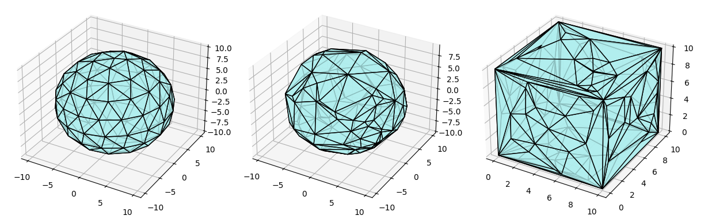

# Convex Polyhedron Generator
This project includes 3 python scripts used to generate convex polyhedron
- `cube.py`: samples points on surfaces of a cube, then triangulate each surface and merge the surfaces into a new triangulated cube
- `sphere.py`: samples points on the surface of a sphere, then compute their convex hull to get a triangulated and spherical-like polyhedron
- `spiral.py`: the same as `sphere.py` but the points are procedurely generated and more evenly spaced

The scripts are based on [this work](https://www.science.smith.edu/~jorourke/books/ftp.html).